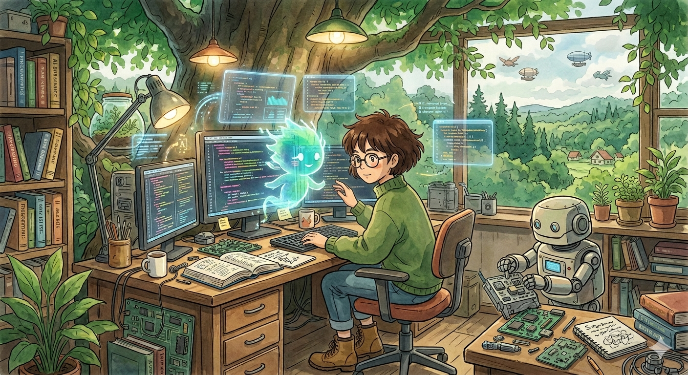
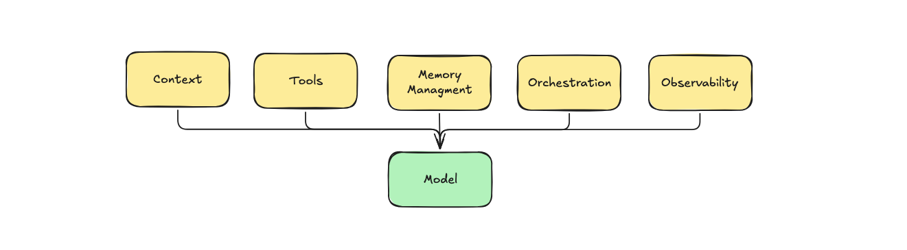
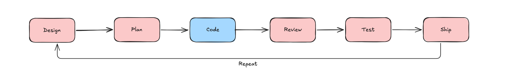
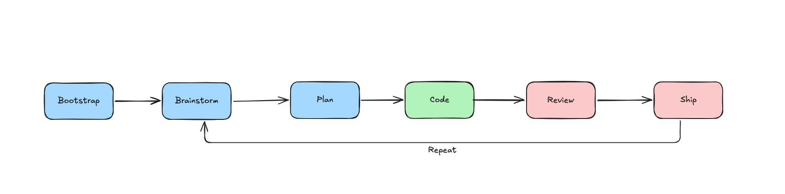
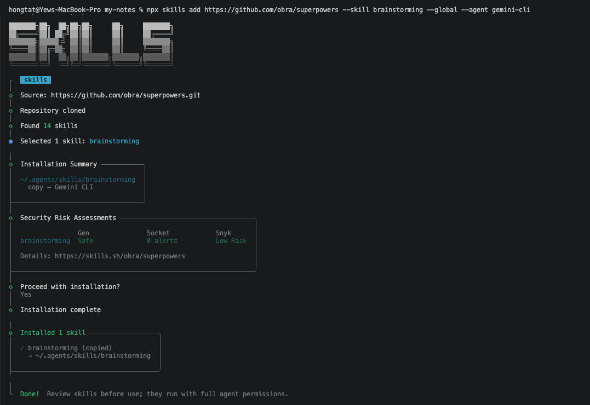
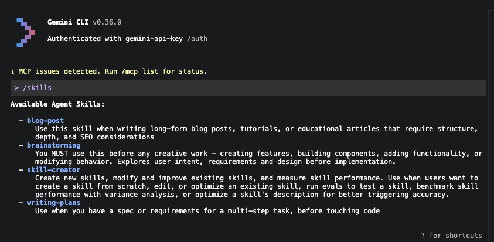
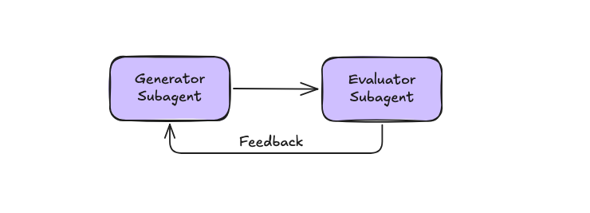

<style>
.pink { color: #FBC9C9; }
.green { color: #B2F2BC; }
.blue { color: #A5D8FF; }
</style>

# A Minimal AI-driven Software Development Lifecycle

## With Using Gemini

---

<!-- _class: invert -->
<style scoped>
h1 {
  position: absolute;
  bottom: 40px;
  left: 40px;
  right: 40px;
  text-align: center;
  color: white;
  text-shadow: 0 0 24px rgba(0, 0, 0, 0.85);
  background: rgba(0, 0, 0, 0.35);
  padding: 0.5em 1em;
  border-radius: 0.8em;
}
</style>

# AI



---

# Challenges

## AI code output is inconsistent

- Different models, different outputs
- you end up fighting the AI to get what you want.

---

# Challenges

## AI multiplies code volume and your review burden

More code generated means more code your team has to read, understand, and validate.

---

# Challenges

## Stakeholders now expect you to ship faster

With AI in the picture, POs, scrum masters, and managers raise the bar on delivery speed.

---

# Challenges

## The current dev lifecycle wasn't built for AI

Current workflows create friction when AI is involved at every stage.

---

# Hong


- Platform Developer @ Ørsted
- Improve developer experience in Ørsted

<style scoped>
p:has(img[alt="RubberDux Hong"]) {
  position: absolute;
  bottom: 24px;
  left: 24px;
  margin: 0;
  font-size: 0.6em;
  opacity: 0.85;
  display: flex;
  align-items: center;
  gap: 6px;
}
p:has(img[alt="RubberDux Hong"]) img {
  width: 32px;
  height: auto;
}
</style>

 RubberDux

---

<!-- _class: invert -->
<style scoped>
h1 {
  position: absolute;
  bottom: 40px;
  left: 40px;
  right: 40px;
}
</style>

# Where software development meets AI


---

# Take this with a grain of salt

I was tasked with exploring how AI can be integrated into our software development lifecycle.

These slides capture my findings, I just hope they don’t become outdated in three months.

---

# 2023

## Prompt Engineering

---

# Hallucination

> You are absolutely right.  

---

# 2025

## Context Engineering

---

# 2025

## Context Engineering

- Performance starts to degrade as the context grows, especially after ~300 lines
- Long context means more tokens, which means higher cost and latency
- Neglect in the middle

---

# 2026

## Harness Engineering


---

# Harness Engineering



---

# Current Development Lifecycle



<span class="blue">⬤</span> Human-led · AI-assist &nbsp; <span class="pink">⬤</span> Human-driven

---

# AI-Native Development Lifecycle



<span class="blue">⬤</span> Human-led · AI-assist &nbsp; <span class="green">⬤</span> AI-driven &nbsp; <span class="pink">⬤</span> Human-driven

---

## Antigravity

```
https://antigravity.google/
```

## Gemini CLI

```bash
npm install -g @google/gemini-cli
```

---

# Agent Skills

Skills are available at `https://skills.sh`.

```bash
npx skills add <git-url> --skill <skill-name> --global --agent gemini-cli 
```

---

<!-- _backgroundColor: #1a1a1a -->



---

<!-- _backgroundColor: #1a1a1a -->



---

# Agent Skills

To use the installed skills, simply invoke them in Gemini CLI:

```bash
/brainstorming 
```

---

# AI-Native Development Lifecycle


<span class="blue">⬤</span> Human-led · AI-assist &nbsp; <span class="green">⬤</span> AI-driven &nbsp; <span class="pink">⬤</span> Human-driven

---

# Bootstrap

Initial project setup with essential files and documentation.

```markdown
project/
├── .github/workflows        # CI/CD pipelines
├── .editorconfig            # Code style configuration
├── .gitignore               # Files to ignore in git
├── AGENTS.md / GEMINI.md    # AI agents
├── CONTRIBUTING.md          # Contribution guidelines
├── ARCHITECTURE.md          # Architecture documentation
└── README.md                # Project overview
```

---

# Bootstrap › ARCHITECTURE.md

```markdown
## Architecture Overview
- High-level description of the system architecture

## Design Principles (Applied)
E.g., SOLID, DRY, KISS, YAGNI, etc.

## Architectural Patterns
E.g., clean architecture, CQRS, event driven, etc.

## Technology Stack
Web API: .NET 10 C#
Database: PostgreSQL, MongoDB, etc.

## Project Structure

```

---

# Bootstrap › CONTRIBUTING.md

```markdown
## Coding Style & Linting

## Branching Strategy

## Commit Message Conventions

## Testing Strategy

## Code Review Process
```

---

# Bootstrap › CI/CD

Set up CI/CD pipelines in `.github/workflows` to automate testing and deployment.

> Pro tips: always start with a deployable application.

---

# Bootstrap › AGENTS.md / GEMINI.md

Treat it as the reference point for Gemini.

```markdown
Strictly follow the following reference without any deviation.

project/
├── docs/
├── CONTRIBUTING.md
├── ARCHITECTURE.md
└── README.md
```

---

# Brainstorm

**Actors:** Product Owner · UI/UX Designer · Application Architect

```bash
# https://skills.sh/obra/superpowers/brainstorming

/brainstorming
```

---

# Brainstorm › Design a spec (specification)

```markdown
## Overview

## Wireframe · API endpoint · Database schema

## Architecture

## Testing

## Out of scope
```

Output: `docs/superpowers/specs/yyyy-mm-dd-spec-name.md`

---

# Plan

**Actors:** Software Architect · Technical Lead · Senior Developer

```bash
# https://skills.sh/obra/superpowers/writing-plans

/writing-plans
```

---

# Plan

```
## File map
## Task breakdown
```

Output: `docs/superpowers/plans/yyyy-mm-dd-feature-name.md`

---

# Code

**Actors:** AI-driven · Developer-assist

```bash
# https://skills.sh/obra/superpowers/subagent-driven-development

/subagent-driven-development
```

---

# Code › Style Guide

Update the skills in CONTRIBUTING.md to ensure consistent code style, e.g.:

- `vercel-labs/agent-skills/vercel-react-best-practices`
- `angular/skills/angular-developer`
- `supabase/agent-skills/supabase-postgres-best-practices`
- or your own custom style guide skill

---

# Code › Tests

Driven by the test defined in the specification.

Red → Green → Refactor

---

# Review › AI Review



- Same session — no context switch  
- Fresh subagent per task — no context pollution  
- No human in the loop — faster iteration

---

# Review › Human

- Code modification when necessary
- Manual testing

---

# Deploy

CI/CD ships to **development** → **staging** → **production**

---

# Monorepo vs Polyrepo

Recommend **polyrepo** (Single Responsibility Principle)

---

# What Do Developers Do?

- Create AI agents and skills to automate tasks
- Ensure the system is well-designed with good architecture and policies
- Manual review and testing when necessary
- Deploy and monitor the system

---

<!-- _class: invert -->
<style scoped>
section {
  display: grid;
  grid-template-columns: repeat(3, auto) 1fr;
  grid-template-rows: auto 1fr;
  align-content: start;
  padding: 48px 56px;
  gap: 64px;
}
h1 {
  grid-column: 1 / 5;
  grid-row: 1;
  margin-bottom: 24px;
  margin-left: 50px;
}
p {
  grid-row: 2;
  display: flex;
  flex-direction: column;
  align-items: center;
  gap: 8px;
  font-size: 0.85em;
  margin: 0 0 0 50px;
}
p img {
  width: 160px;
  height: auto;
}
</style>

# Thanks for listening

 [LinkedIn](https://www.linkedin.com/in/hongtat/)

 [RubberDux.dev](https://RubberDux.Dev)

 [Slides](https://hongtatyew.github.io/talk-ai-dev-lifecycle)


